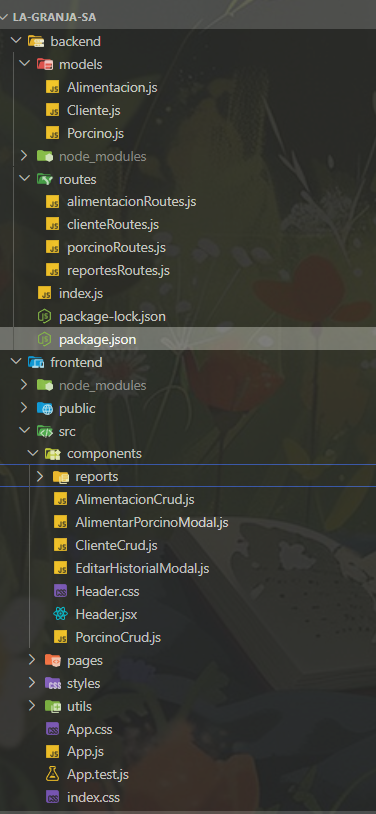

# La Granja S.A. — Gestión Porcina

Sistema full‑stack para gestionar porcinos, clientes y alimentaciones con historial, inventario, y módulo de reportes con exportación a PDF incorporando el logo de la granja.

---

## Demo
- Módulos principales:
  - CRUD de Porcinos con historial de alimentaciones y control de stock.
  - CRUD de Clientes con eliminación en cascada de porcinos asociados.
  - CRUD de Alimentaciones con stock y trazabilidad.
  - Reportes: Trazabilidad por alimento, Consumo por cliente y Consumo por alimentación, con exportación a PDF (logo, título, tablas y paginado).
- UI con tema propio (paleta verde/terracota) y header persistente con logo.

---

## Features
- Gestión completa:
  - Porcinos: alta, edición, borrado, historial de alimentaciones con snapshot “inmutable” (se conserva el nombre aunque se elimine el alimento original).
  - Clientes: eliminación en cascada (al borrar un cliente, se borran sus porcinos).
  - Alimentaciones: stock, registro de consumo, y devolución de stock al borrar registros del historial.
- Reportes operativos con PDF:
  - Trazabilidad por alimento.
  - Consumo por cliente (eventos, total lbs, nº porcinos).
  - Consumo por alimentación (eventos, total lbs, % del período).
- UX/UI:
  - Paleta de colores centralizada con CSS variables.
  - Header con logo y navegación persistente.
  - Botones compactos con iconos accesibles (➕ ✏️ 🗑️ 📜).
  - SweetAlert2 tematizado (confirmaciones, loaders).
- Robustez:
  - Manejo de errores consistente en backend (404/400/500).
  - Validaciones de frontend y backend.
  - Modo de consulta en reportes: Local (rápido) o Servidor (agregaciones en BD para grandes volúmenes).

---

## Installation steps
Guía desde cero. Se requieren:
- Node.js LTS (v18+ recomendado)
- npm o pnpm
- MongoDB en local (o Atlas). Para transacciones, habilitar replica set (opcional).

1) Clonar repositorio
```
cd la-granja-sa
```
2) Back-end (API Express + Mongoose)
```
cd backend
```
- Editar .env con la cadena de conexión (MONGODB_URI) y puerto (PORT=5000)

```
npm install
node index.js
```
3) Front-end (React)
```
cd ../frontend
npm install
npm start
```
- La app abrirá en http://localhost:3000 y consumirá la API en http://localhost:5000 (ajustable en variables o constantes).

4) Datos iniciales (opcional)
- Crear algunos Clientes, Alimentaciones y Porcinos desde la UI para probar.
- Ver módulo Reportes en la ruta “/reports”.

Descargas necesarias
- Node.js: https://nodejs.org/
- MongoDB Community Server: https://www.mongodb.com/try/download/community
- (Opcional) MongoDB Compass: https://www.mongodb.com/products/compass

---

## The process
- Diseño de datos:
  - Modelo Porcino con arreglo `historialAlimentacion` que guarda `alimentacion` (ref) y snapshot (`nombreSnapshot`, `descripcionSnapshot`) para trazabilidad aún si se elimina la alimentación original.
  - Modelos Cliente y Alimentacion con índices convenientes.
- Reglas de negocio:
  - Registrar alimentación: descuenta stock y agrega registro al historial.
  - Editar historial: ajusta stock por delta; si la alimentación original ya no existe, el registro es de solo lectura.
  - Borrar historial: devuelve stock sólo si la alimentación existe; elimina registro siempre.
  - Eliminar cliente: borra en cascada sus porcinos (con transacción si hay replica set).
- Reportes:
  - Modo Local: calcula con datos ya cargados en memoria para periodos pequeños.
  - Modo Servidor: ejecuta agregaciones MongoDB ($unwind, $group, $lookup) con filtros por fechas e IDs.
  - Exportación a PDF: jsPDF + autoTable, con logo, título/subtítulo, encabezado con color de marca y pie de página con numeración.

### Build with
- Frontend:
  - React + CSS variables
  - SweetAlert2
  - jsPDF + jspdf-autotable (exportación PDF con logo)
- Backend:
  - Node.js + Express
  - Mongoose (MongoDB)
- Herramientas:
  - npm scripts (dev/start/build)
  - (Opcional) MongoDB Replica Set para transacciones

### Structure


---

### Class Diagram


---

## Useful resources
- React: crear proyecto y estructura de archivos (MDN/getting started).
- jsPDF + autoTable: generación de PDF y tablas con encabezados y estilos (exportación).

---

## License
Sin licencia

---

## Authors
  - Mateo Berrío Cardona
  - Mariana Montoya Sepúlveda


